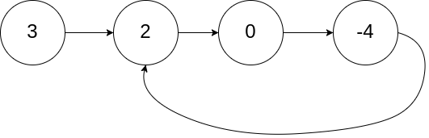

#141. Linked List Cycle
 <b>Easy</b>

Given head, the head of a linked list, determine if the linked list has a cycle in it. 
There is a cycle in a linked list if there is some node in the list that can be reached again by continuously following the next pointer. Internally, pos is used to denote the index of the node that tail's next pointer is connected to. Note that pos is not passed as a parameter. 
Return true if there is a cycle in the linked list. Otherwise, return false. 

<b>Example 1: 
 
Input: head = [3,2,0,-4], pos = 1 
Output: true 
Explanation: There is a cycle in the linked list, where the tail connects to the 1st node (0-indexed). 

Example 2: 
 
Input: head = [1,2], pos = 0 
Output: true 
Explanation: There is a cycle in the linked list, where the tail connects to the 0th node. 

Example 3: 
 
Input: head = [1], pos = -1 
Output: false 
Explanation: There is no cycle in the linked list. 

Constraints: 
The number of the nodes in the list is in the range [0, 104]. 
-105 <= Node.val <= 10 to the 5th power 
pos is -1 or a valid index in the linked-list. 

Follow up: Can you solve it using O(1) (i.e. constant) memory?
