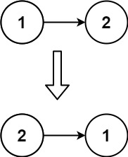

<b>#206. Reverse Linked List</b>
 <b>Easy</b>

Given the head of a singly linked list, reverse the list, and return the reversed list. 

<b>Example 1:</b> 
 
Input: head = [1,2,3,4,5] 
Output: [5,4,3,2,1] 

<b>Example 2:</b> 
 
Input: head = [1,2] 
Output: [2,1] 

<b>Example 3:</b> 
Input: head = [] 
Output: [] 

<b>Constraints:</b> 
The number of nodes in the list is the range [0, 5000]. 
-5000 <= Node.val <= 5000
