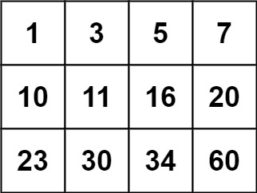

<b>#74. Search a 2D Matrix</b>
 <b>Medium</b>

You are given an m x n integer matrix matrix with the following two properties: 

Each row is sorted in non-decreasing order. 
The first integer of each row is greater than the last integer of the previous row. 
Given an integer target, return true if target is in matrix or false otherwise. 

You must write a solution in O(log(m * n)) time complexity. 

<b>Example 1:</b> 
 
Input: matrix = [[1,3,5,7],[10,11,16,20],[23,30,34,60]], target = 3 
Output: true 

<b>Example 2:</b> 
 
Input: matrix = [[1,3,5,7],[10,11,16,20],[23,30,34,60]], target = 13 
Output: false 

<b>Constraints:</b> 
m == matrix.length 
n == matrix[i].length 
1 <= m, n <= 100 
-10 to the 4th power <= matrix[i][j], target <= 10 to the 4th power 

